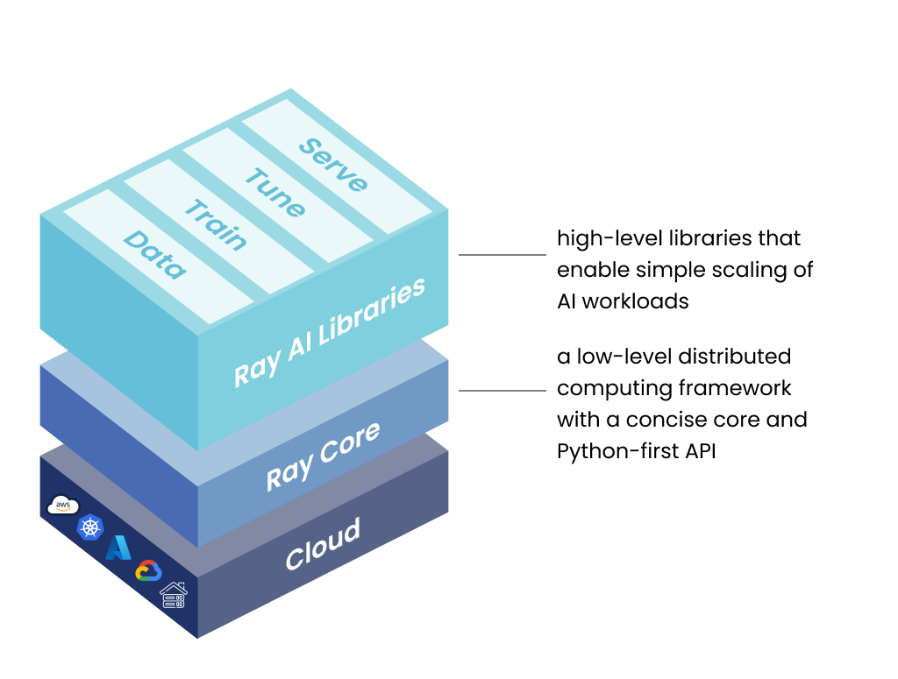
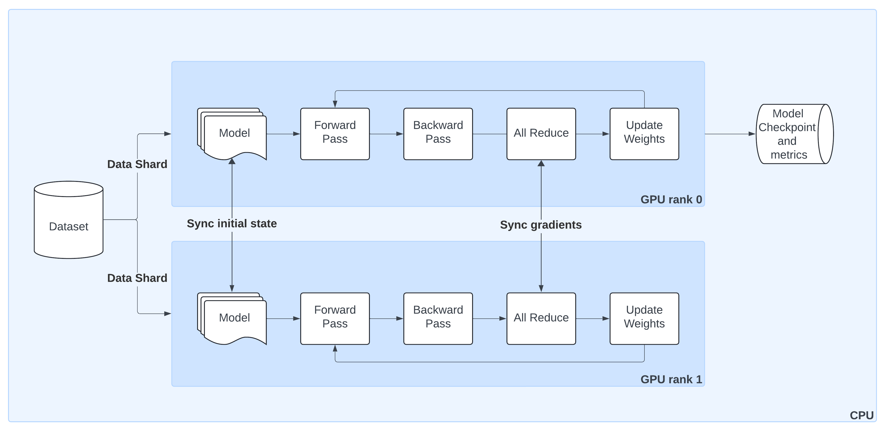

What is Ray?

Ray is a open source very user friendly,  AI Compute Engine for scaling AI and Python applications like machine learning.
It lets you build and run distributed workloads without having low level distributed system expertise.

You can connect Ray to any cloud provider
You can use low level Ray Core library to manage distributed compute directly
You can use Ray Data, Serve, Train & Tune to abstract away all the complexities of managing distributed data workloads, Serving training and tuning implementations.

Ray can connect to snowflake, arrow to pytorch or hyperopt for tuning to fastapi, gradio, mlflow for serving.

So.. this was the brief overview lets dive into tutorials.

Ray train can privison infrastructure using autoscaler,  train in distributed manner, provided observability & fault taularence

Distributed Training with Pytorch
DistributedDataParallel (DDP) training with ALL Reduce algorithm for syncing the gradient

So rather than syncing whole model we simply sync graidents after each training loop

In order to have a single gpu pytorch model to be migrated to ray train

we need following:
1. Congigure GPUS
2. Migrate model to ray train
3. migrate dataset to ray train
4. build checkpoints and metrics reporting
5. Configure storage

Ray data:
lazy loading
map_batches to processes abteches of data in parallel
map_batches(transformation_func, batch_format='",batch_size=1024)

Shuffling by files
or block order shuffling randomize_block_shuffle (shuffle in node)
randomize_shuffle randomize across all nodes

group_by would be slow

doing repartition with
ds.repartition(num_cpus=8).groupby(..)
map_groups can be used also

Note on execution triggering methods in Ray Dataset

To determine if an operation will trigger execution, look for the methods with the ConsumptionAPI decorator in the Dataset.py.

These categories of operations trigger execution (with some examples):

Method designed to consume Datasets for writing:

write_parquet

Method designed to consume Datasets for distributed training:

streaming_split

Methods that attempt to show data, for example:

take

show

Aggregations, which attempt to reduce a dataset to a single value per column:

min

sum

Another way to trigger execution is to explicitly call materialize(). This will execute the underlying plan and generate the entire data blocks onto the cluster’s memory.

ds_normalized = ds.map_batches(normalize, batch_size=32, num_cpus=1, memory=100 * 1024**2)